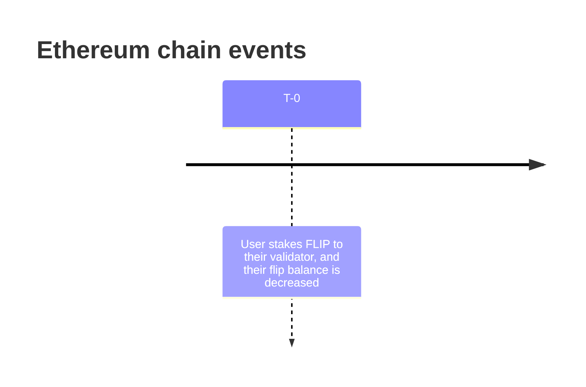
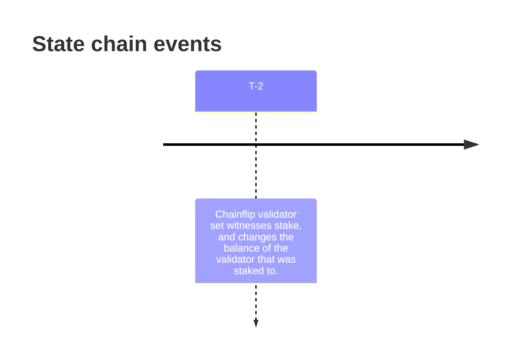

# chainflip-indexer

## What is this?

On [chainflip](https://chainflip.io) the process of staking and claiming FLIP on or from the state chain onto the ethereum chain is not instant and there is some delay. 

### Stakes & Claims

*Note:* Claims work in the same fashion, but in the reverse order.

Due to this process, at `T-1`, the FLIP is essentially gone, as it is not on the ethereum or state chain, and in a process of transitioning. This can be problematic for a couple reasons particularly if you are trying to keep track of multiple validators that are being staked and claimed from, because tokens can "disappear" at times.

### Functionality

This indexer exposes an API that you can query the balance of your validator at an *ethereum and chainflip height*. Contrary to querying the chain directly for the balance, this will include pending stakes and claims from the ethereum chain that have not been completed yet.

## Installation & Usage

*Prequisites*
- Docker

Install
`git clone https://github.com/thunderhead-os/chainflip-indexer && cd chainflip-indexer`

Create a config file at `./config.json`, that follows `.example.config.json`

Start
`docker compose up`

